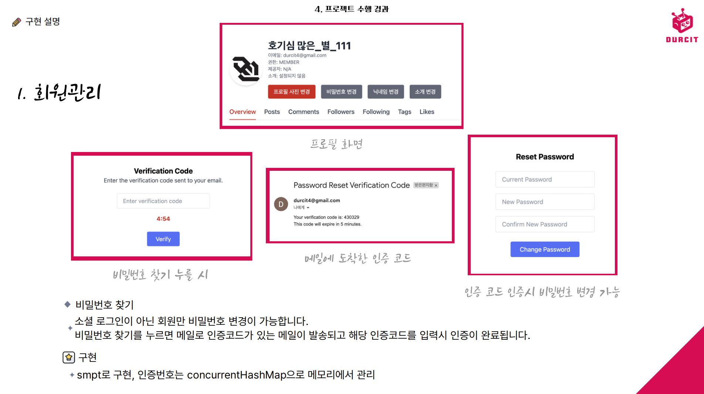
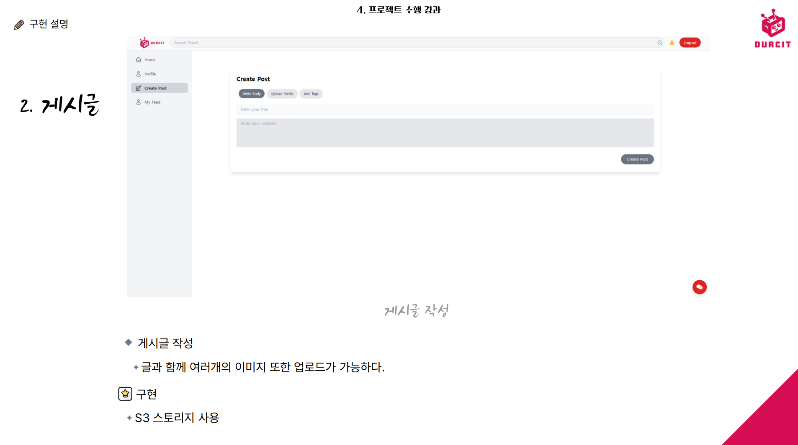
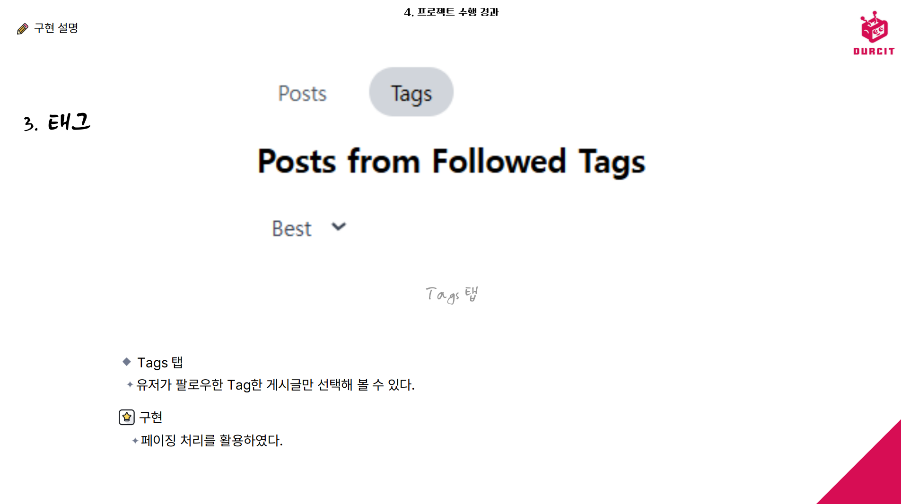
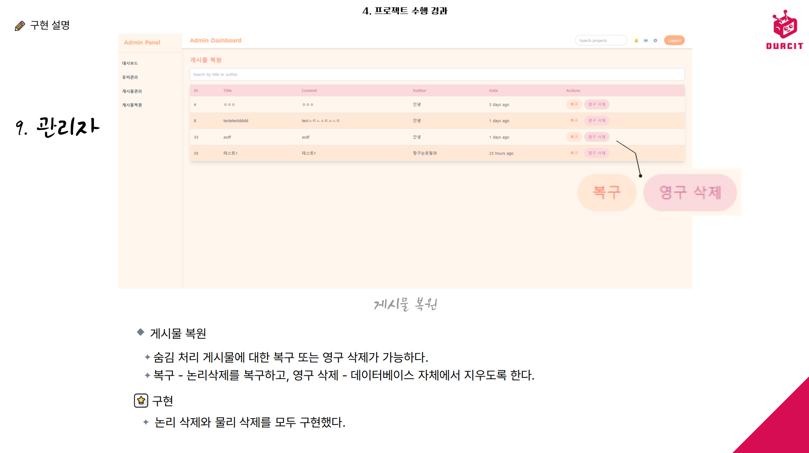

# 3차 프로젝트 - **Durcit 팀프로젝트 (durcit team project)**

## 💡 팀(팀명:질수없조) 프로젝트


메인 페이지: [https://durcit.site](https://durcit.site) (현재는 운영이 닫힌 상태)  
어드민 페이지: [https://admin.durcit.site](https://admin.durcit.site) (현재는 운영이 닫힌 상태)

<br><br>

---

## 리포지터리 링크

* 소개 링크: https://github.com/yoda-yoda/Project3_durcit-overview  
* 스프링: https://github.com/yoda-yoda/Project3_durcit-spring  
* 리액트: https://github.com/yoda-yoda/Project3_durcit-react  
* 리액트(관리자 기능) : https://github.com/yoda-yoda/Project3_durcit-admin  
* 배포 : https://github.com/yoda-yoda/project3-durcit-spring-deploy

<br><br>

---
## 개요

<details>
<summary> ppt 이미지로 보기 </summary>














<br>
</details>

[▲개요로 스크롤](#개요)

<br><br>


<details open>
<summary> 글로 보기 </summary>


# 3차 프로젝트 - **Durcit 팀프로젝트 (durcit team project)**

## 💡 팀(팀명:질수없조) 프로젝트


### 목적
- **Durcit**은 Reddit에서 영감을 받아 만들어진 게임 커뮤니티 플랫폼으로, 게이머들이 활발하게 소통하고 콘텐츠를 공유할 수 있는 공간입니다.    

- 다양한 기능을 통해 사용자가 더 편리하고 재미있게 커뮤니티 활동을 즐길 수 있도록 설계되었습니다.

<br>

### Durcit의 의미  
- **Durc =>** 백엔드 어플리케이션의 핵심 기술인 CRUD (생성, 조회, 수정, 삭제) 를 거꾸로 하였습니다.

- **it =>** '그것' 이라는 영단어를 차용했습니다.  

- **Durc + it =>** 2가지가 합쳐진 'DURCIT'은 '상상하는 그것을 CRUD 한다' 라는 의미를 갖습니다.


<br><br>


---


## 🌟 주요 기능

### 1. 회원관리

- OAuth 2.0 기반 소셜 로그인(Google, Kakao, Naver) 및 이메일 인증 기반 직접 회원가입 지원.

- 프로필 관리: 닉네임·프로필 사진·자기소개 수정 가능, 비밀번호 찾기/변경(SMTP 인증) 제공.

- 권한 체계: 게스트, 멤버, 매니저, 관리자 4단계로 구분하여 기능 접근 제어.

- 개인 피드 및 다른 회원 피드 열람 가능.

### 2. 게시글

- 게시글 CRUD 지원: 글 작성, 이미지 다중 업로드(S3 연동), 조회, 수정, 삭제(Soft Delete).

- 정렬 방식 제공: Best(조회순), Hot(댓글·좋아요순), New(최신순).

- 게시글 조회 시 조회수 자동 증가.

- 좋아요 및 공감 이모티콘 제공, 소켓 기반 실시간 반응 공유.

### 3. 태그

- 게시글 작성 시 복수 태그 추가 가능.

- 검색창을 통한 태그 기반 게시글 검색 지원.

- Tags 탭에서 사용자가 팔로우한 태그 게시글만 확인 가능(페이징 처리 포함).

### 4. 댓글

- 댓글 및 대댓글 작성 가능, CRUD 지원.

- @닉네임 멘션 기능 제공 → 해당 회원에게 푸쉬 알림 발송.

- 멘션 입력 시 자동완성 리스트 표시.

### 5. 푸쉬 알림

- 멘션, 팔로우(계정·태그), 채팅 등 주요 이벤트 발생 시 실시간 알림 제공.

- WebSocket, 메시징 큐 활용.

- 읽지 않은 알림은 토스트 알림으로 표시.

### 6. 팔로우

- 계정 팔로우: 특정 사용자를 팔로우하면, 해당 사용자의 새 글 등록 시 알림 수신.

- 태그 팔로우: 특정 태그를 팔로우하면, 해당 태그가 포함된 글 등록 시 알림 수신.

- 팔로우/언팔로우는 토글 방식으로 구현.

### 7. 검색

- 검색 기능: 게시글 제목, 태그, 유저 닉네임 검색 지원.

- 키워드 기반으로 입력된 문자열이 포함된 모든 결과 반환.

### 8. 채팅

- 회원 간 1:1 채팅 기능 제공.

- 채팅방 목록에서 사용자별 채팅 내역 확인 가능.

- 실시간 대화 및 메시지 송수신 가능.

### 9. 관리자

- 대시보드: 총 사용자, 게시물, 활동 로그 수 확인 가능(그래프 시각화).

- 로그 관리: 사용자 활동(Endpoint, http 메서드, 상태코드 등) 기록 및 상세 View 제공.

- 회원 관리: 전체 계정 검색, 정지, 삭제, 역할 변경 가능.

- 게시물 관리: 논리 삭제(soft delete로 숨김처리), 영구 삭제(delete), 복원 기능 제공.

<br><br>

---

## 🚀**개발 환경**

<br>


- ### 아키텍처


<br><br>

- ### **ERD**


<br><br>

- ### **플로우 차트**


<br><br>

- ### **활용 기술**

| 분류 | 기술 상세 |
| :--- | :--- |
| **IDE** | IntelliJ, WebStorm, VSCode |
| **버전 관리 시스템** | Git, GitHub |
| **언어** | Java, JavaScript |
| **프레임워크** | **백엔드:** Spring Boot( jpa / websoket / security / jwt / rabbitMQ )  **프론트엔드:** React, Tailwind CSS |
| **데이터베이스** | MySQL |
| **배포 환경** | Nginx, AWS( S3(파일 업로드) / EC2 / RDS / Route 53 ) |


<br><br><br>

---
## 팀 구성 및 역할

##### 박유빈 (팀장)
- **담당 역할**: 백엔드 개발
- **담당 업무**:
    - 회원 가입 및 로그인 기능 개발 (JWT, Spring Security, SMTP)
    - RESTful API 설계 및 문서화 (Swagger)
    - MySQL 데이터베이스 설계 및 JPA 활용
    - S3를 활용한 이미지 업로드 및 관리 기능 구현
    - AOP를 활용한 로깅 및 권한 검사
    - 웹소켓과 RabbitMQ를 활용한 실시간 기능 구현 (푸시 알람, 채팅, 이모지)
    - 배포 환경 설정 및 운영


##### 신명진 (팀원)
- **담당 역할**: 프론트엔드 개발
- **담당 업무**:
    - Admin 페이지 개발 (유저 관리, 게시물 수정, 복원 페이지 개발)
    - Redux와 Tailwind CSS를 활용한 UI 및 상태 관리
    - 인증이 필요한 기능(프로필 조회, 게시물 작성 등) 접근 제한 로직 구현
    - 메인 UI 컴포넌트 구현 (Sidebar, TopBar, 드롭다운 로그인 창 등)
    - Axios를 활용한 통신 로직 작성 및 에러 처리


##### 최민호 (팀원)
- **담당 역할**: 서비스 기획
- **담당 업무**:
    - 서비스 기획 및 회의록 작성
    - 데이터베이스 설계


##### 최요셉 (팀원)
- **담당 역할**: 백엔드 개발
- **담당 업무**:
    - 태그, 태그 팔로우, 검색, 닉네임 변경 기능 개발 (메인)
    - 게시물 복구 및 영구 삭제 기능 개발 (Admin)
    - MySQL 데이터베이스 설계 및 Spring Data JPA 활용
    - RESTful API 설계
    - AssertJ, JUnit 기반 TDD 진행


<br><br><br>

---

## 📅 프로젝트 수행 절차 및 일정

| 구분 | 기간 (2024) | 활동 | 비고 |
| :--- | :--- | :--- | :--- |
| **사전 기획과 구조 설계** | 12.11.(수) | 주제 선정, 기획 및 구조 설계 | 요구사항 정리, ERD, 피그마 |
| **협업 방식 기획** | 12.12.(목) | 코딩 컨벤션, 깃 브랜칭 설정, 역할 배분 | 스크럼 방식 |
| **기능 개발** | 12.13.(금) ~ 12.27.(금) | 맡은 역할, 다음 역할 개발 | 코딩 컨벤션 준수 |
| **점검 및 배포** | 12.27.(금) ~ 12.31.(화) | 작동 점검 및 배포 | 오류 수정 및 최종 배포 |


<br><br><br>

---


## 트러블 슈팅
#### 1. 삭제된 게시물 복구 기능 구현 중, 복구 후 상태 관리 문제 (신명진)

- **문제**:
  삭제된 게시물을 복구할 때, 복구된 게시물이 화면에 계속 남아 있는 문제가 발생했습니다. 이는 복구 작업 후 삭제된 게시물 리스트에서 해당 게시물을 제거하는 로직이 누락되어 발생한 문제였습니다.

- **원인**:
    - `useState`를 사용한 상태 관리에서 복구된 게시물을 필터링하지 않았습니다.
    - API 요청은 성공했지만, 상태 업데이트가 올바르게 적용되지 않아 UI가 갱신되지 않았습니다.

- **해결 방법**:
    - `handleRestore` 함수에서 `setDeletedPosts`를 사용해 복구된 게시물을 상태에서 제거하도록 수정했습니다.

```javascript
const handleRestore = async (postId) => {
  try {
    await restoreDeletedPost(postId); // 복구 API 호출
    setDeletedPosts(deletedPosts.filter(post => post.id !== postId)); // 상태에서 제거
  } catch (err) {
    console.error('Failed to restore post:', err);
  }
};

```
- **결과**:
    - 복구된 게시물이 즉시 화면에서 제거되어 사용자 경험이 개선되었습니다.

<br>

#### 2. AOP 요청/응답 로깅 중 HttpServletRequest 다중 읽기 문제 (박유빈)

- **문제**:
  AOP로 API 요청/응답 로깅을 구현하는 과정에서 `HttpServletRequest`의 페이로드를 이미 읽은 경우, 이후 다시 읽을 수 없는 문제가 발생했습니다. 이로 인해 정확한 로깅이 어려워지고, 시스템 디버깅과 모니터링 효율성이 저하되었습니다.
- **모색**:
    - `HttpServletRequest`의 `getInputStream` 또는 `getReader` 메서드는 한 번 호출 후 내부 스트림을 닫아버려 다시 읽을 수 없는 구조입니다.
    - 다중 읽기가 필요한 경우 이를 미리 캐싱하지 않으면 문제가 발생합니다.
- **해결 방법**:
    1. `CachedBodyHttpServletRequest` 구현
        - 원래의 `HttpServletRequest`를 래핑하여 요청 바디를 캐싱.
        - 캐싱된 데이터를 활용해 요청 바디를 다중 읽기 가능하도록 처리.
    2. 필터 추가 (`CachedBodyFilter`)
        - 모든 요청을 캐싱된 요청으로 변환.
        - `multipart/form-data`는 캐싱하지 않도록 처리.

```java
@Override
public void doFilter(ServletRequest request, ServletResponse response, FilterChain chain) throws IOException, ServletException {
    if (request instanceof HttpServletRequest) {
        HttpServletRequest httpRequest = (HttpServletRequest) request;

        if (httpRequest.getContentType() != null && httpRequest.getContentType().startsWith("multipart/form-data")) {
            chain.doFilter(request, response);
            return;
        }

        HttpServletRequest cachedRequest = new CachedBodyHttpServletRequest(httpRequest);
        chain.doFilter(cachedRequest, response);
    } else {
        chain.doFilter(request, response);
    }
}
```

- **결과**
  AOP에서 `HttpServletRequest`를 다중 읽기가 가능해졌고, 정확한 요청/응답 로깅이 가능해졌습니다. 로깅의 신뢰도가 향상되었으며, 디버깅과 모니터링 작업이 훨씬 용이해졌습니다.


<br>

#### 3. 작업에 대한 구체적인 이해 부족 문제 (최요셉)

- **문제**:
  게시물에 태그 기능을 추가해야 했으나, 구체적으로 무엇을 해야 하는지 명확하지 않아 어려움이 있었습니다. 즉, 어떤 폴더에 어떤 파일을 만들고, 어떤 메서드를 만들어야 하는지 등 구체적인 행동이 떠오르지 않았습니다.
- **모색**:
    - 문제를 해결하기 위해 목표를 한 문장씩 적어보며 구체성을 높였습니다.
    - 아래와 같은 방식으로 사고를 구체화:
        - "유저는 게시물에 태그를 추가할 수 있다." → "추가한다는 것은 무엇을 의미할까?"
        - "유저가 입력하면 DB에 저장되고 추가된 것이 화면에 표시된다."
        - "유저는 어떻게 입력해야 하는가?" → "어떤 버튼을 눌러야 하는가?" → "입력 후 다시 제출 버튼을 눌러야 하는가?"
        - 이후 이를 구체적인 개발 작업으로 변환.
- **해결 방법**:
    - 구체화 과정을 통해 필요한 작업과 구현 방법이 명확해졌습니다.
    - 태그 입력을 위한 뷰 구성, 컨트롤러와 메서드 작성, DB 저장 로직 구현 등을 단계적으로 진행했습니다.
- **결과**:
  구체적인 작업 계획을 세우고 실행할 수 있었으며, 태그 기능을 성공적으로 구현할 수 있었습니다.

<br><br><br>

---

# API 명세서

<br><br>

## Admin API 명세서

- #### Admin 인증 API

| **기능**       | **Method** | **URL**           | **Request Body**                                    | **Response**                                                                                   |
|----------------|------------|-------------------|---------------------------------------------------|-----------------------------------------------------------------------------------------------|
| 로그인          | POST       | /admins/login   | { "username": "string", "password": "string" }   | { "accessToken": "string", <br/>"refreshToken": "string" }                                       |

<br>

- #### 통계 API

| **기능**               | **Method** | **URL**                | **Request Body** | **Response**                                                     |
|------------------------|------------|------------------------|------------------|------------------------------------------------------------------|
| 대시보드 통계 조회      | GET        | /statistics          | -                | { "code": "GET_ADMIN_LOG_SUCCESS", <br/>"data": { ... } }           |
| 최근 통계 조회          | GET        | /statistics/recent   | -                | { "code": "GET_ADMIN_LOG_SUCCESS", <br/>"data": [ ... ] }           |

<br>

- #### 로그 API

| **기능**               | **Method** | **URL**                | **Request Body** | **Response**                                                     |
|------------------------|------------|------------------------|------------------|------------------------------------------------------------------|
| 로그 전체 조회 (페이징) | GET        | /logs                | -                | { "code": "GET_ADMIN_LOG_SUCCESS", <br/>"data": { "content": [ ... ] } } |
| 최근 로그 조회          | GET        | /logs/recent         | -                | { "code": "GET_ADMIN_LOG_SUCCESS", <br/>"data": [ ... ] }           |

<br>

- #### 역할 관리 API

| **기능**               | **Method** | **URL**                              | **Request Body** | **Response**                               |
|------------------------|------------|--------------------------------------|------------------|------------------------------------------|
| 역할을 ADMIN으로 변경  | PUT        | /role-updates-admin/{memberId}     | -                | { "code": "UPDATE_ROLE_SUCCESS" }       |
| 역할을 MANAGER로 변경  | PUT        | /role-updates-manager/{memberId}   | -                | { "code": "UPDATE_ROLE_SUCCESS" }       |
| 역할을 MEMBER로 변경   | PUT        | /role-updates-member/{memberId}    | -                | { "code": "UPDATE_ROLE_SUCCESS" }       |

<br>

- #### 사용자 관리 API

| **기능**            | **Method** | **URL**                | **Request Body** | **Response**                                                     |
|---------------------|------------|------------------------|------------------|------------------------------------------------------------------|
| 사용자 목록 조회     | GET        | /users               | -                | { "code": "GET_USER_PROFILE_SUCCESS", <br/>"data": [ ... ] }        |
| 사용자 차단          | PUT        | /block/{memberId}    | -                | { "code": "UPDATE_USER_BLOCK_STATUS" }                         |
| 사용자 차단 해제     | PUT        | /unblock/{memberId}  | -                | { "code": "UPDATE_USER_BLOCK_STATUS" }                         |
| 사용자 삭제          | DELETE     | /delete/{memberId}   | -                | { "code": "DELETE_USER_PERMANENT_SUCCESS" }                    |

<br>

- #### 게시글 관리 API

| **기능**            | **Method** | **URL**                              | **Request Body** | **Response**                                                     |
|---------------------|------------|--------------------------------------|------------------|------------------------------------------------------------------|
| 게시글 복원          | PUT        | /posts/{postId}/restore            | -                | { "code": "RECOVER_POST_SUCCESS" }                             |
| 게시글 목록 조회     | GET        | /posts                             | -                | { "code": "GET_POST_SUCCESS", <br/>"data": [ ... ] }                |
| 숨겨진 게시글 조회   | GET        | /posts/hide                        | -                | { "code": "GET_POST_SUCCESS", <br/>"data": [ ... ] }                |
| 게시글 숨기기        | DELETE     | /posts/{postId}/hide               | -                | { "code": "DELETE_POST_SUCCESS" }                              |
| 게시글 영구 삭제     | DELETE     | /posts/{postId}/permanent          | -                | { "code": "DELETE_POST_SUCCESS" }                              |


<br><br>


## Chat API 명세서

- #### 공통 정보
**Base URL**: /api/members

<br>

- #### WebSocket 기반 채팅 API

| **기능**        | **Method** | **URL**           | **Request Body**                                     | **Response**                                    |
|-----------------|------------|-------------------|----------------------------------------------------|------------------------------------------------|
| 채팅 메시지 전송 | WebSocket  | /chat/send      | { "roomId": "string", <br/>"senderId": "string", <br/>"message": "string" } | -                                              |

<br>

- #### REST 기반 채팅 API

| **기능**              | **Method** | **URL**                            | **Request Body**                                   | **Response**                                                                                     |
|-----------------------|------------|------------------------------------|--------------------------------------------------|--------------------------------------------------------------------------------------------------|
| 채팅방 생성           | POST       | /rooms                           | { "roomName": "string", <br/>"creatorId": "string" }| { "code": "CREATE_CHAT_ROOM_SUCCESS", <br/>"data": { "roomId": "string", "roomName": "string" } } |
| 사용자의 채팅방 조회  | GET        | /rooms                           | -                                                | { "code": "GET_CHAT_ROOM_SUCCESS", <br/>"data": [ { "roomId": "string", "roomName": "string" } ] } |
| 특정 채팅방 메시지 조회 | GET        | /rooms/{roomId}/messages         | -                                                | { "code": "GET_CHAT_SUCCESS", <br/>"data": [ { "messageId": "                                         |


<br><br>


## Comment API 명세서

- #### 공통 정보
**Base URL**: /api

<br>

- #### Comment API

| **기능**              | **Method** | **URL**                          | **Request Body**                                   | **Response**                                                                                     |
|-----------------------|------------|----------------------------------|--------------------------------------------------|-------------------------------------------------------------------------------------------------|
| 댓글 등록              | POST       | /members/comments             | { "postId": "number", "content": "string" }     | { "code": "CREATE_COMMENT_SUCCESS", <br/>"data": { "commentId": "number", "content": "string" } }  |
| 댓글 수정              | PUT        | /members/comments             | { "commentId": "number", "content": "string" } | { "code": "UPDATE_COMMENT_SUCCESS" }                                                         |
| 댓글 삭제              | DELETE     | /members/comments/{commentId} | -                                                | { "code": "DELETE_COMMENT_SUCCESS" }                                                         |
| 사용자의 댓글 조회      | GET        | /members/my-comments/{memberId} | -                                                | { "code": "GET_COMMENT_SUCCESS", <br/>"data": [ { "commentId": "number", "content": "string" } ] } |

<br>


- #### Mention API

| **기능**              | **Method** | **URL**             | **Request Body**  | **Response**                                                                                     |
|-----------------------|------------|---------------------|-------------------|-------------------------------------------------------------------------------------------------|
| 멘션 가능한 멤버 조회  | GET        | /members/mentions | query=string    | { "code": "GET_MENTION_POSSIBLE_MEMBERS_SUCCESS", <br/>"data": [ { "memberId": "number", "name": "string" } ] } |


<br><br>


## Feed & Post Facade API 명세서

- #### 공통 정보
**Base URL**: /api

<br>

- #### Feed API

| **기능**              | **Method** | **URL**                  | **Request Body** | **Response**                                                                                     |
|-----------------------|------------|--------------------------|------------------|-------------------------------------------------------------------------------------------------|
| 사용자 정보 조회       | GET        | /feeds/users/{userId}  | -                | { "code": "GET_USER_PROFILE_SUCCESS", <br/>"data": { "userId": "number", "userName": "string", ... } } |

<br>

- #### Post Facade API

| **기능**              | **Method** | **URL**                          | **Request Body**                                   | **Response**                                                                                     |
|-----------------------|------------|----------------------------------|--------------------------------------------------|-------------------------------------------------------------------------------------------------|
| 게시글 등록            | POST       | /members/posts                | { "title": "string", "content": "string", ... } | { "code": "CREATE_POST_SUCCESS", <br/>"data": "number" }                                            |
| 게시글 상세 조회        | POST       | /posts/{postId}               | memberId: "number"                              | { "code": "GET_POST_SUCCESS", <br/>"data": { "postId": "number", "title": "string", ... } }         |
| 게시글 수정            | PUT        | /members/posts/{postId}       | { "title": "string", "content": "string", ... } | { "code": "UPDATE_POST_SUCCESS" }                                                             |
| 게시글 삭제            | DELETE     | /members/posts/{postId}       | -                                                | { "code": "DELETE_POST_SUCCESS" }                                                             |


<br><br>

## Follow API 명세서

- #### 공통 정보
**Base URL**: /api/members

<br>

- #### 멤버 팔로우 API

| **기능**            | **Method** | **URL**                     | **Request Body**                         | **Response**                                                                                     |
|---------------------|------------|-----------------------------|------------------------------------------|-------------------------------------------------------------------------------------------------|
| 팔로우 토글          | POST       | /follows/toggle           | { "followeeId": "number" }             | { "code": "TOGGLE_MEMBER_FOLLOW_SUCCESS" }                                                    |
| 특정 멤버 팔로우 여부 | GET        | /follows                  | followeeId: number                     | { "code": "GET_MEMBER_FOLLOWER_SUCCESS", <br/>"data": true/false }                                 |
| 팔로워 목록 조회      | GET        | /follows/followers        | followeeId: number                     | { "code": "GET_MEMBER_FOLLOWER_SUCCESS", <br/>"data": [ { "memberId": "number", "name": "string" } ] } |
| 팔로잉 목록 조회      | GET        | /follows/followees        | followerId: number                     | { "code": "GET_MEMBER_FOLLOWEE_SUCCESS", <br/>"data": [ { "memberId": "number", "name": "string" } ] } |

<br>

- #### 태그 팔로우 API

| **기능**               | **Method** | **URL**                     | **Request Body**                             | **Response**                                                                                     |
|------------------------|------------|-----------------------------|----------------------------------------------|-------------------------------------------------------------------------------------------------|
| 태그 팔로우 토글        | POST       | /tag-follow/{memberId}/post | { "tagId": "number" }                      | { "code": "CREATE_TAG_FOLLOW_SUCCESS", <br/>"data": { "tagId": "number", "tagName": "string", ... } } |
| 멤버의 태그 팔로우 조회 | GET        | /tag-follow/{memberId}    | -                                            | { "code": "GET_TAG_FOLLOW_SUCCESS", <br/>"data": [ { "tagId": "number", "tagName": "string", ... } ] } |


<br><br>

## Post API 명세서

- #### 공통 정보
**Base URL**: /api

<br>

- #### Emoji API

| **기능**              | **Method** | **URL**         | **Request Body**                         | **Response**                                                                                     |
|-----------------------|------------|-----------------|------------------------------------------|-------------------------------------------------------------------------------------------------|
| 이모지 추가/토글      | WebSocket  | /addEmoji     | { "postId": "number", "emojiType": "string" } | { "code": "EMOJI_TOGGLE_SUCCESS", <br/>"data": { "postId": "number", "emojiType": "string" } }     |

<br>

- #### Like API

| **기능**               | **Method** | **URL**                      | **Request Body** | **Response**                                                                                     |
|------------------------|------------|------------------------------|------------------|-------------------------------------------------------------------------------------------------|
| 게시글 좋아요 개수 조회 | GET        | /members/likes/{postId}/count | -                | { "code": "GET_POST_LIKES_SUCCESS", <br/>"data": "number" }                                         |
| 게시글 좋아요 토글      | POST       | /members/likes/{postId}/toggle | -                | { "code": "TOGGLE_LIKE_SUCCESS", <br/>"data": true/false }                                         |
| 사용자가 좋아요한 게시글 조회 | GET   | /members/likes/{memberId} | -                | { "code": "GET_POST_LIKES_SUCCESS", <br/>"data": [ { "postId": "number", "title": "string", ... } ] } |

<br>

- #### Post API

| **기능**                      | **Method** | **URL**                               | **Request Body**                                   | **Response**                                                                                     |
|-------------------------------|------------|---------------------------------------|--------------------------------------------------|-------------------------------------------------------------------------------------------------|
| 전체 게시글 조회              | GET        | /                                   | -                                                | { "code": "GET_POST_SUCCESS", <br/>"data": [ { "postId": "number", "title": "string", ... } ] }     |
| 게시글 페이지네이션 조회       | GET        | /posts/pages                        | { "page": "number", "size": "number", "category": "string" } | { "code": "GET_POST_SUCCESS", <br/>"data": { "content": [ ... ], "pageable": { ... } } }            |
| 팔로우한 태그로 게시글 조회   | GET        | /posts/pages/tags                   | { "page": "number", "size": "number", "memberId": "number", "category": "string" } | { "code": "GET_POST_SUCCESS", <br/>"data": { "content": [ ... ], "pageable": { ... } } }            |
| 태그 검색으로 게시글 조회      | GET        | /posts/search/tags                  | tag=string&page=number&size=number              | { "code": "GET_POST_SUCCESS", <br/>"data": { "content": [ ... ], "pageable": { ... } } }            |
| 내 게시글 조회                | GET        | /members/my-posts                   | -                                                | { "code": "GET_POST_SUCCESS", <br/>"data": [ { "postId": "number", "title": "string", ... } ] }     |
| 특정 사용자의 피드 게시글 조회 | GET        | /feed/{userId}                      | -                                                | { "code": "GET_POST_SUCCESS", <br/>"data": [ { "postId": "number", "title": "string", ... } ] }     |

<br>

- #### (미완성/주석 처리된) 게시글 작성/수정/삭제 API

| **기능**                      | **Method** | **URL**                       | **Request Body**                                   | **Response**                                                                                     |
|-------------------------------|------------|-------------------------------|--------------------------------------------------|-------------------------------------------------------------------------------------------------|
| 게시글 작성                   | POST       | /members                   | { "title": "string", "content": "string", ... } | { "code": "CREATE_POST_SUCCESS", <br/>"data": { "postId": "number", "title": "string", ... } }      |
| 게시글 수정                   | PUT        | /members/{postId}          | { "title": "string", "content": "string", ... } | { "code": "UPDATE_POST_SUCCESS" }                                                             |
| 게시글 삭제                   | DELETE     | /members/{postId}          | -                                                | { "code": "DELETE_POST_SUCCESS" }                                                             |
| 게시글 상세 조회 및 조회수 증가 | GET        | /{postId}                  | -                                                | { "code": "GET_POST_SUCCESS", <br/>"data": { "postId": "number", "title": "string", ... } }         |


<br><br>

## Push Notification API 명세서

- #### 공통 정보
**Base URL**: /api/members/pushs

<br>

- #### Push API

| **기능**                     | **Method** | **URL**                     | **Request Body** | **Response**                                                                                     |
|------------------------------|------------|-----------------------------|------------------|-------------------------------------------------------------------------------------------------|
| 특정 멤버의 푸시 알림 조회    | GET        | /                         | memberId: string | { "code": "GET_PUSHS_SUCCESS", <br/>"data": [ { "pushId": "number", "message": "string", "status": "string" } ] } |
| 특정 푸시 알림 확인 처리      | PUT        | /{pushId}/confirm         | -                | { "code": "UPDATE_PUSH_SUCCESS" }                                                             |

<br><br>


## Search API 명세서

- #### 공통 정보
**Base URL**: /api/search

<br>

- #### Search API

| **기능**                 | **Method** | **URL**      | **Request Body**                              | **Response**                                                                                     |
|--------------------------|------------|--------------|-----------------------------------------------|-------------------------------------------------------------------------------------------------|
| 검색 결과 조회           | GET        | /          | query: string                               | { "code": "SEARCH_SUCCESS", <br/>"data": [ { "id": "number", "type": "string", "content": "string" } ] } |


<br><br>


## Security API 명세서

<br>

- #### 인증 (Auth) API

| **기능**                     | **Method** | **URL**         | **Request Body**                                 | **Response**                                                                                     |
|------------------------------|------------|-----------------|------------------------------------------------|-------------------------------------------------------------------------------------------------|
| 로그인                       | POST       | /auth/login   | { "username": "string", "password": "string" } | { "accessToken": "string", "refreshToken": "string" }                                         |
| 로그아웃                     | POST       | /auth/logout  | { "refreshToken": "string" }                  | {}                                                                                           |
| 회원가입                     | POST       | /auth/register | multipart/form-data                          | { "code": "CREATED_USER" }                                                                   |
| 이메일 인증                  | POST       | /auth/verify  | { "token": "string" }                         | { "code": "VERIFY_EMAIL_SUCCESS" }                                                           |

<br>

- #### 비밀번호 재설정 API

| **기능**                     | **Method** | **URL**                     | **Request Body**                 | **Response**                                                                                     |
|------------------------------|------------|-----------------------------|----------------------------------|-------------------------------------------------------------------------------------------------|
| 비밀번호 재설정 요청          | POST       | /api/members/passwords/request | -                              | { "code": "SEND_EMAIL_SUCCESS" }                                                              |
| 인증 코드 확인               | POST       | /api/members/passwords/verify | { "code": "string" }          | { "code": "VERIFY_EMAIL_SUCCESS" } <br/>or { "code": "VERIFY_EMAIL_FAIL" }                      |
| 비밀번호 변경                | POST       | /api/members/passwords/change  | { "newPassword": "string" }   | { "code": "PASSWORD_RESET_SUCCESS" }                                                         |

<br>

- #### 프로필 관리 API

| **기능**                     | **Method** | **URL**                                | **Request Body**                                 | **Response**                                                                                     |
|------------------------------|------------|----------------------------------------|------------------------------------------------|-------------------------------------------------------------------------------------------------|
| 프로필 조회                  | GET        | /api/members/profile                 | -                                              | { "code": "GET_USER_PROFILE_SUCCESS", <br/>"data": { "nickname": "string", "bio": "string", ... } }|
| 닉네임 변경                  | PUT        | /api/members/profile/nickname-updates| { "nickname": "string" }                     | { "code": "UPDATE_NICKNAME_SUCCESS", <br/>"data": { "nickname": "string", "bio": "string", ... } } |
| 닉네임 중복 확인             | GET        | /api/members/profile/nickname-checks | nickname=string                              | { "code": "CHECK_DUPLICATE_NICKNAME_SUCCESS", <br/>"data": true/false }                            |
| 자기소개 변경                | PUT        | /api/members/profile/bio-updates     | { "bio": "string" }                          | { "code": "UPDATE_BIO_SUCCESS", <br/>"data": { "nickname": "string", "bio": "string", ... } }      |
| 자기소개 조회                | GET        | /api/members/profile/bio             | -                                              | { "code": "GET_BIO_SUCCESS", <br/>"data": "string" }                                               |

<br><br>


## Upload API 명세서

- #### 공통 정보
**Base URL**: /api/members

<br>

- #### 프로필 이미지 업로드 API

| **기능**               | **Method** | **URL**                     | **Request Body**                             | **Response**                                                                                     |
|------------------------|------------|-----------------------------|----------------------------------------------|-------------------------------------------------------------------------------------------------|
| 프로필 이미지 업데이트 | PUT        | /profile                 | MultipartFile                              | { "code": "UPDATE_PROFILE_IMAGE_SUCCESS" }                                                    |

<br>

- #### 파일 업로드 API

| **기능**               | **Method** | **URL**                     | **Request Body**                             | **Response**                                                                                     |
|------------------------|------------|-----------------------------|----------------------------------------------|-------------------------------------------------------------------------------------------------|
| 파일 업로드            | POST       | /upload/files            | { "postId": "number", "files": [MultipartFile, ...] } | { "code": "UPLOAD_FILES_SUCCESS" }                                                            |
| 파일 업데이트          | PUT        | /upload/update           | { "postId": "number", <br/>"imageIdsToDelete": [number, ...], <br/>"newFiles": [MultipartFile, ...] } | { "code": "UPDATE_FILES_SUCCESS" }                                                            |

<br>


</details>


[▲개요로 스크롤](#개요)


<br>
<br>
<br>
<br>
<br>


